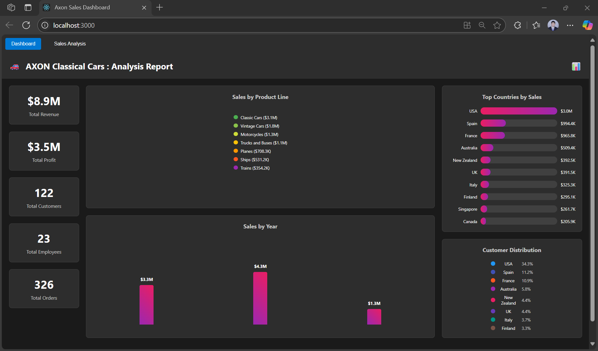
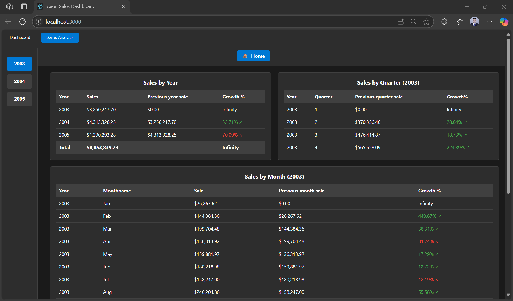
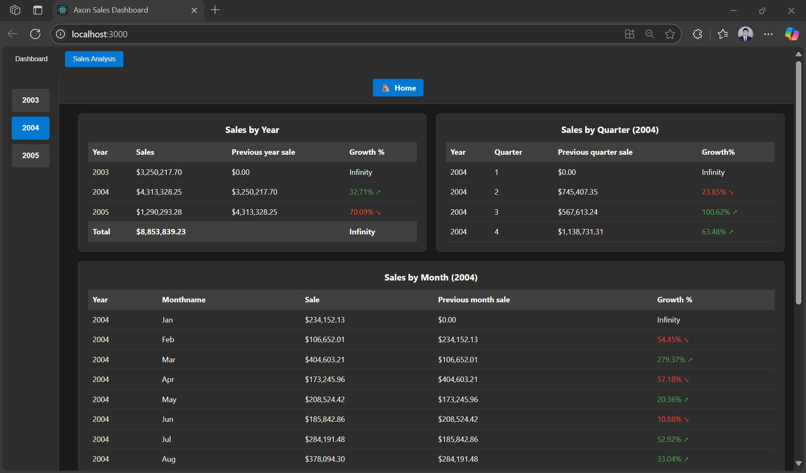
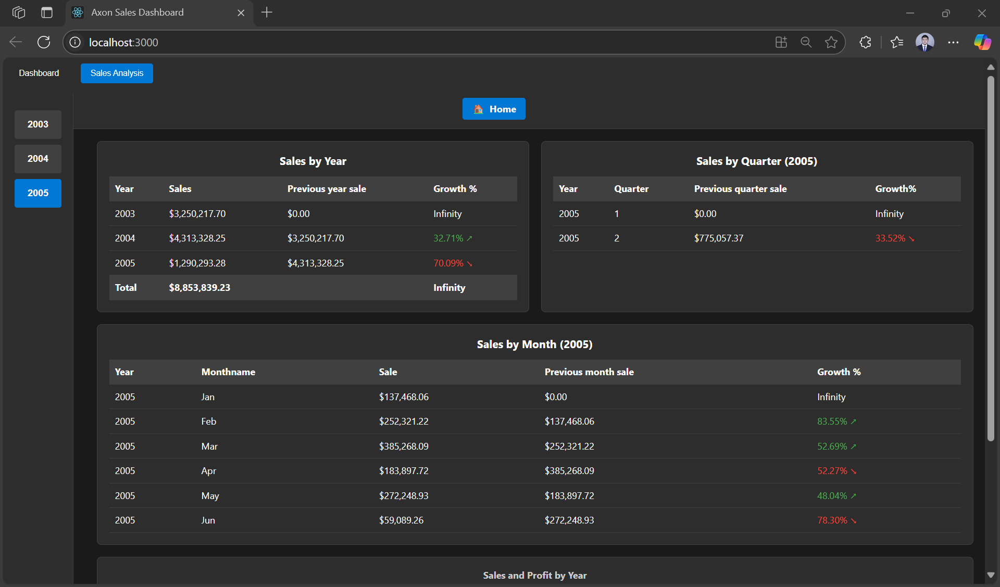
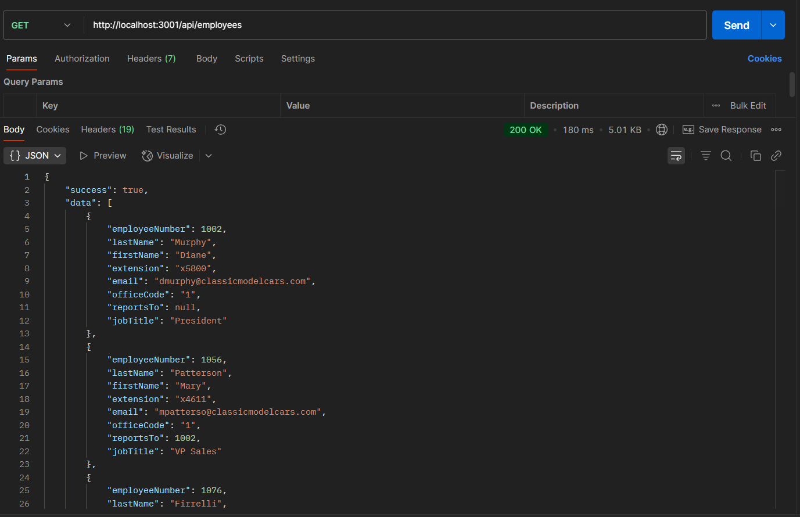
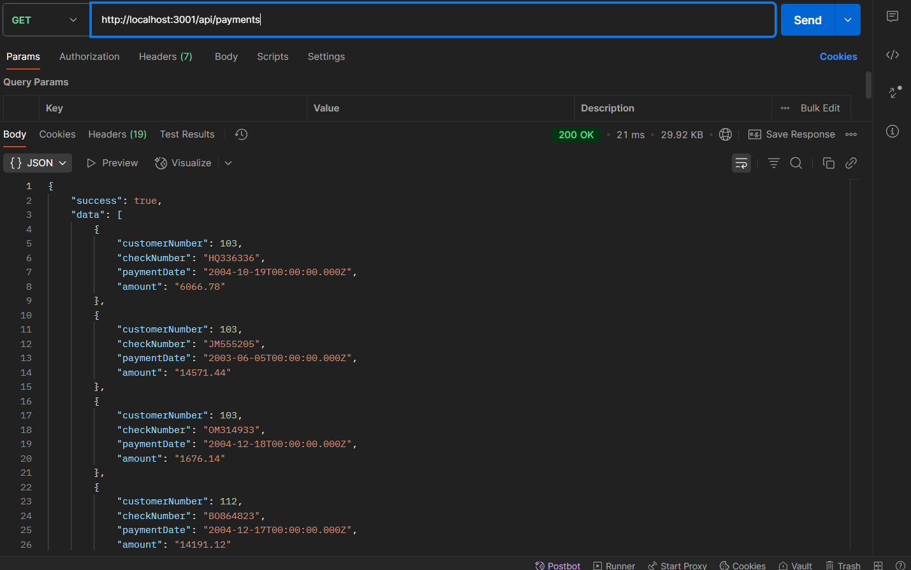

<div align="center">
  <h1 style="text-align: center;font-weight: bold">LAPORAN RESMI<br>WORKSHOP ADMINISTRASI JARINGAN</h1>
  <h4 style="text-align: center;">Dosen Pengampu : Dr. Ferry Astika Saputra, S.T., M.Sc.</h4>
</div>
<br />
<div align="center">
  
  <h3 style="text-align: center;">Disusun Oleh : </h3>
  <p style="text-align: center;">
    <strong>Ale Perdana Putra Darmawan (3123500027) </strong><br>
  </p>
<h3 style="text-align: center;line-height: 1.5">Politeknik Elektronika Negeri Surabaya<br>Departemen Teknik Informatika Dan Komputer<br>Program Studi Teknik Informatika<br>2024/2025</h3>
  <hr><hr>
</div>

## Daftar Isi
- [Daftar Isi](#daftar-isi)
- [Teknologi yang digunakan](#teknologi-yang-digunakan)
- [Struktur Frontend](#struktur-frontend)
  - [Components](#components)
    - [Services](#services)
    - [App Configuration](#app-configuration)
- [Struktur Backend](#struktur-backend)
- [Hasil Akhir](#hasil-akhir)

## Teknologi yang digunakan
- Frontend menggunakan ReactJS untuk menciptakan antarmuka pengguna yang interaktif dan dinamis di browser pengguna. Sisi frontend ini akan berkomunikasi dengan backend melalui API untuk mengambil atau mengirim data.

- Backend menggunakan ExpressJS untuk membangun API yang menangani logika komunikasi dengan database. Layanan ini berjalan di dalam kontainer Docker pada port 3000 yang diekspos ke port 3001 di IP address lokal.

- Database menggunakan MySQL untuk menyimpan classicmodels database. Database ini juga berjalan di dalam kontainer Docker sendiri dan dapat diakses melalui port 3306.

- Docker digunakan untuk mengemas backend dan database ke dalam kontainer yang terisolasi, memastikan keduanya berjalan secara konsisten di lingkungan mana pun. Teknologi ini mengatur pemetaan port agar layanan dapat saling berkomunikasi dan dapat diakses dari luar.

## Struktur Frontend
Source Code: https://github.com/AlePerdana/frontend-adjar.git

### Components
- Dashboard.jsx: Komponen utama yang menampilkan halaman dashboard dengan visualisasi data penjualan dan informasi overview bisnis. Dilengkapi dengan styling melalui `Dashboard.css` untuk mengatur tampilan layout, card, dan elemen-elemen dashboard.

- SalesAnalysis.jsx: Komponen yang menangani analisis data penjualan dengan fitur filtering, sorting, dan visualisasi grafik. Memiliki styling khusus melalui `SalesAnalysis.css` untuk mengatur tampilan tabel, chart, dan control elements.

#### Services
- api.js: File konfigurasi dan fungsi-fungsi API yang menangani komunikasi dengan backend ExpressJS di port 3001. Berisi berbagai endpoint API:
  - getCustomers(): API untuk mengambil data pelanggan dengan dukungan filtering berdasarkan parameter tertentu
  - getOrders(): API untuk mengambil data pesanan dengan kemampuan filtering berdasarkan tanggal, status, atau customer
  - getEmployees(): API untuk mengambil data karyawan dengan opsi filtering departemen atau jabatan
  - getPayments(): API untuk mengambil data pembayaran dengan filtering berdasarkan periode atau jumlah
  - getOffices(): API untuk mengambil data kantor cabang dengan filtering lokasi atau negara
  - getSalesSummary(): API untuk menghitung ringkasan penjualan total termasuk revenue, profit, dan jumlah order
  - getSalesByCountry(): API untuk menganalisis penjualan berdasarkan negara dengan pengelompokan customer dan total sales
  - getSalesByProductLine(): API untuk menganalisis penjualan berdasarkan kategori produk dengan distribusi realistis
  - getSalesByYear(): API untuk menganalisis trend penjualan tahunan berdasarkan data order dan payment
  - testConnection(): API untuk menguji konektivitas dengan backend server

#### App Configuration
- App.js: File utama aplikasi React yang mengatur routing dan struktur komponen utama serta menangani integrasi dengan API service untuk komunikasi dengan backend ExpressJS.

- main.jsx: Entry point aplikasi yang merender komponen App ke DOM.

## Struktur Backend
Source Code: https://github.com/ARVAZAKI/backend-adjar2.git

### 1. Service Mysql
- docker compose mysql
```
version: '3.8'

services:
  mysql:
    image: mysql:8.0
    container_name: mysql_container
    restart: always
    ports:
      - "3306:3306"
    environment:
      MYSQL_ROOT_PASSWORD: ${MYSQL_ROOT_PASSWORD}
      MYSQL_DATABASE: ${MYSQL_DATABASE}
      MYSQL_USER: ${MYSQL_USER}
      MYSQL_PASSWORD: ${MYSQL_PASSWORD}
    volumes:
      - mysql_data:/var/lib/mysql

volumes:
  mysql_data:

```
Penjelasan : kode docker-compose.yml di atas menggunakan versi 3.8 dan mendefinisikan satu service bernama mysql yang menjalankan image mysql:8.0 dalam sebuah container bernama mysql_container. Container ini akan selalu direstart jika berhenti, dan memetakan port 3306 di host ke port 3306 di dalam container. Variabel lingkungan seperti MYSQL_ROOT_PASSWORD, MYSQL_DATABASE, MYSQL_USER, dan MYSQL_PASSWORD digunakan untuk mengatur konfigurasi awal database dan diambil dari file .env. Data MySQL disimpan secara persisten menggunakan volume bernama mysql_data yang dipetakan ke direktori /var/lib/mysql di dalam container.

### Env yang digunakan pada service mysql
```
MYSQL_ROOT_PASSWORD=kelompok2
MYSQL_DATABASE=adjar
MYSQL_USER=kelompok2
MYSQL_PASSWORD=kelompok2

```

#### Melakukan import file .sql untuk mendapatkan data
```
docker cp axon_sales.sql mysql_container:/tmp/axon_sales.sql
```
Penjelasan : melakukan copy file sql yang berada pada lokal ke dalam container docker
```
mysql -u kelompok2 -pkelompok2 adjar < axon_sales.sql
```
Penjelasan : melakukan command ketika sudah berada pada dalam container untuk import data dari file sql

### 2. Service Express JS
docker compose : 
```
version: "3.8"

services:

  app:
    build:
      context: .
      dockerfile: Dockerfile
    container_name: p2-oc-api
    ports:
      - "3001:3000"
    env_file:
      - .env
    volumes:
      - /app/node_modules
    restart: unless-stopped
    healthcheck:
      disable: true
    depends_on: []  
    networks:
      - app-network

networks:
  app-network:
    driver: bridge
```
Penjelasan : 
kode `docker-compose.yml` di atas menggunakan versi 3.8 dan mendefinisikan satu service bernama `app` yang akan membangun image dari Dockerfile yang berada di direktori saat ini (`.`). Container yang dihasilkan diberi nama `p2-oc-api` dan memetakan port 3001 di host ke port 3000 di dalam container. Variabel lingkungan diambil dari file `.env`, dan volume `/app/node_modules` digunakan agar direktori `node_modules` di container tidak tertimpa oleh bind mount (biasanya untuk keperluan development). Container akan otomatis restart kecuali dihentikan secara manual (`unless-stopped`), tidak menggunakan healthcheck, tidak memiliki dependensi service lain (`depends_on: []`), dan terhubung ke jaringan bernama `app-network` yang menggunakan driver `bridge`.

#### Env yang dipakai di service express js
```

DB_HOST=host.docker.internal
DB_PORT=3306
DB_USER=kelompok2
DB_PASSWORD=kelompok2
DB_NAME=adjar

PORT=3000
NODE_ENV=development

```
Melakukan koneksi dari container express js dengan mysql agar bisa terhubung karena menggunakan network yang sama

```
docker network connect <nama_network> mysql_container

```
## Hasil Akhir
- Dashboard.jsx
<br><div style=width:500;></div>

- SalesAnalysis.jsx
<br><div style=width:500;></div>
<br><div style=width:500;></div>
<br><div style=width:500;></div>

- Api
<br><div style=width:500;></div>
<br><div style=width:500;></div>