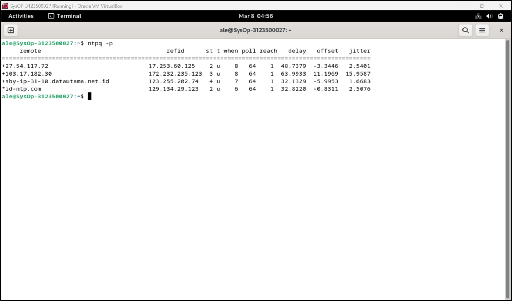
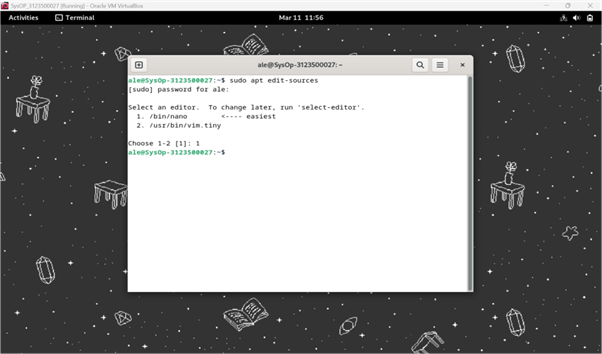
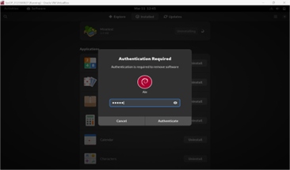
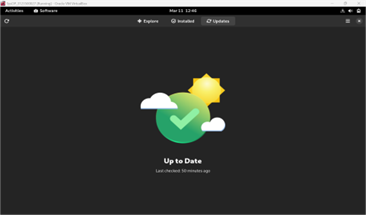
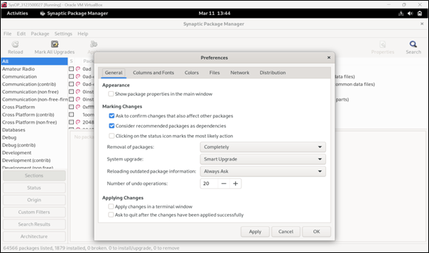
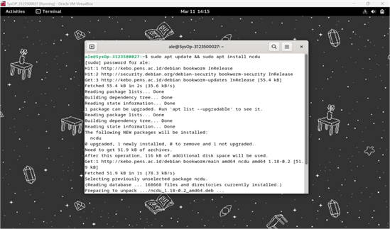
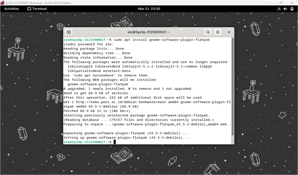

<div align="center">
  <h1 style="text-align: center;font-weight: bold">LAPORAN RESMI<br>WORKSHOP ADMINISTRASI JARINGAN</h1>
  <h4 style="text-align: center;">Dosen Pengampu : Dr. Ferry Astika Saputra, S.T., M.Sc.</h4>
</div>
<br />
<div align="center">
  
  <h3 style="text-align: center;">Disusun Oleh : </h3>
  <p style="text-align: center;">
    <strong>Ale Perdana Putra Darmawan (3123500027) </strong><br>
  </p>
<h3 style="text-align: center;line-height: 1.5">Politeknik Elektronika Negeri Surabaya<br>Departemen Teknik Informatika Dan Komputer<br>Program Studi Teknik Informatika<br>2024/2025</h3>
  <hr><hr>
</div>

## Daftar Isi
- [Daftar Isi](#daftar-isi)
- [A. Instalasi NTP Client](#a-instalasi-ntp-client)
- [B. Instalasi dan konfigurasi Samba](#b-instalasi-dan-konfigurasi-samba)
  - [Pembuatan public folder](#pembuatan-public-folder)
  - [Pembuatan limited folder](#pembuatan-limited-folder)
- [C. Rangkuman tentanag package management.](#c-rangkuman-tentanag-package-management)
  - [8.1 Sumber Perangkat Lunak](#81-sumber-perangkat-lunak)
  - [8.1.1 Berkas sources.list](#811-berkas-sourceslist)
  - [8.1.2 Tentang Repositori, Cabang, dan Bagian/Komponen](#812-tentang-repositori-cabang-dan-bagiankomponen)
  - [8.1.3 Paket Backport](#813-paket-backport)
  - [8.1.4 Memodifikasi Repositori](#814-memodifikasi-repositori)
  - [8.2 APT dalam Terminal](#82-apt-dalam-terminal)
  - [8.2.1 Perintah 'Pengguna' untuk Mencari dan Menampilkan Informasi](#821-perintah-pengguna-untuk-mencari-dan-menampilkan-informasi)
  - [8.2.2 Perintah Mode 'Administrator' untuk Pemeliharaan Sistem](#822-perintah-mode-administrator-untuk-pemeliharaan-sistem)
  - [8.3 Software: Manajer Paket yang Disederhanakan](#83-software-manajer-paket-yang-disederhanakan)
  - [8.3.1 Software: Mencari Aplikasi](#831-software-mencari-aplikasi)
  - [8.3.2 Software: Menginstal Aplikasi](#832-software-menginstal-aplikasi)
  - [8.3.3 Software: Menghapus Aplikasi](#833-software-menghapus-aplikasi)
  - [8.3.4 Software: Memperbarui Aplikasi](#834-software-memperbarui-aplikasi)
  - [8.3.5 Software: Memodifikasi Repositori Paket](#835-software-memodifikasi-repositori-paket)
  - [8.3.6 Pembaruan Otomatis dengan Software](#836-pembaruan-otomatis-dengan-software)
  - [8.4 Discover: Manajer Paket KDE](#84-discover-manajer-paket-kde)
  - [8.4.1 Mencari dan Menginstal dengan Discover](#841-mencari-dan-menginstal-dengan-discover)
  - [8.4.1.1 Menginstal Widget dan Addon Plasma Desktop](#8411-menginstal-widget-dan-addon-plasma-desktop)
  - [8.4.2 Menghapus Aplikasi dengan Discover](#842-menghapus-aplikasi-dengan-discover)
  - [8.4.3 Discover: Memperbarui Aplikasi Anda](#843-discover-memperbarui-aplikasi-anda)
  - [8.4.4 Discover: Mengelola Repositori](#844-discover-mengelola-repositori)
  - [8.5 Synaptic: Manajer Paket Komprehensif](#85-synaptic-manajer-paket-komprehensif)
  - [8.5.1 Synaptic: Antarmuka Utama](#851-synaptic-antarmuka-utama)
  - [8.5.2 Mengelola Repositori dengan Synaptic](#852-mengelola-repositori-dengan-synaptic)
  - [8.5.4 Mencari Perangkat Lunak](#854-mencari-perangkat-lunak)
  - [8.5.5 Menginstal Paket dengan Synaptic](#855-menginstal-paket-dengan-synaptic)
  - [8.5.5.1 Menginstal Ulang Paket](#8551-menginstal-ulang-paket)
  - [8.5.6 Menghapus Paket dengan Synaptic](#856-menghapus-paket-dengan-synaptic)
  - [8.5.6.1 Synaptic: Membersihkan Paket yang Tidak Berguna](#8561-synaptic-membersihkan-paket-yang-tidak-berguna)
  - [8.5.6.2 Menghapus Residu Konfigurasi](#8562-menghapus-residu-konfigurasi)
  - [8.5.7 Melihat Informasi Detail tentang Paket](#857-melihat-informasi-detail-tentang-paket)
  - [8.5.8 Preferensi Synaptic](#858-preferensi-synaptic)
  - [8.6 Membersihkan Sistem](#86-membersihkan-sistem)
  - [8.6.1 Informasi Ruang Disk](#861-informasi-ruang-disk)
  - [8.6.2 Membersihkan Paket](#862-membersihkan-paket)
  - [8.6.3 Mengosongkan Tempat Sampah](#863-mengosongkan-tempat-sampah)
  - [8.6.4 Membersihkan Cache Aplikasi](#864-membersihkan-cache-aplikasi)
  - [8.6.5 Membersihkan Thumbnail](#865-membersihkan-thumbnail)
  - [8.7 Menginstal Paket Eksternal “.deb”](#87-menginstal-paket-eksternal-deb)
  - [8.7.1 Instalasi dalam Mode Grafis dengan GDebi](#871-instalasi-dalam-mode-grafis-dengan-gdebi)
  - [8.7.2 Instalasi dalam Mode Terminal dengan Dpkg](#872-instalasi-dalam-mode-terminal-dengan-dpkg)
  - [8.8 Menginstal Aplikasi Flatpak](#88-menginstal-aplikasi-flatpak)
  - [8.8.1 Menginstal Flatpak](#881-menginstal-flatpak)
  - [8.8.3 Mengelola Aplikasi Flatpak di Gnome dengan Software](#883-mengelola-aplikasi-flatpak-di-gnome-dengan-software)
  - [8.8.4 Mengelola Aplikasi Flatpak di KDE dengan Discover](#884-mengelola-aplikasi-flatpak-di-kde-dengan-discover)
  - [8.8.5 Mengelola Aplikasi Flatpak dari Terminal](#885-mengelola-aplikasi-flatpak-dari-terminal)
  - [8.8.6 Menghapus Aplikasi Flatpak](#886-menghapus-aplikasi-flatpak)
  - [8.9 Siapakah Sid Ini?](#89-siapakah-sid-ini)


## A. Instalasi NTP Client
Langkah 1:
Instalasi NTP Client menggunakan bash `sudo apt -y install ntpsec`.
<br><div style=width:500;></div>

Langkah 2:
Setelah selesai instalasi, gunakan `sudo nano /etc/ntpsec/ntp.conf` untuk mengakses file konfigurasi NTP Client.
<br><div style=width:500;></div>

Langkah 3:
Pada dalam ntp.conf, beri komen (#) pada pool ke empat pool yang ada dan masukkan server Indonesia yang dapat disalin dari web `https://www.ntppool.org/en/zone/id` .
 <br><div style=width:500;></div>

Langkah 4:
Setelah konfigurasi, lakukan restart untuk NTP Client untuk menggunakan konfigurasi yang baru dengan bash `systemctl restart ntpsec`.
<br><div style=width:500;></div>
 
Langkah 5:
Untuk melihat jika sudah tersambung dengan server, gunakan bash `ntpq -p`.
 <br><div style=width:500;></div>

Hasil:
 <br><div style=width:500;></div>


## B. Instalasi dan konfigurasi Samba 
Instalasi samba:
Untuk menginstal samba, gunakan bash `Sudo apt -y install samba`.
 <br><div style=width:500;></div>

Konfigurasi network:
Agar Virtual Machine dapat menggunakan internet, konfigurasi network menjadi Bridged Adapter.
 <br><div style=width:500;></div>
 
### Pembuatan public folder
Langkah 1:
Membuat direktori dengan menggunaakn bash `sudo mkdir /home/public`.
 <br><div style=width:500;></div>

Langkah 2:
Merubah akses agar semua dapat write, read, dan excute dengan bash `chmod 777 /home/public`.
 <br><div style=width:500;></div>

Langkah 3:
Konfigurasi file samba menggunakan `sudo nano /etc/samba/smb.conf`.
  <br><div style=width:500;></div>

Langkah 4:
Menambahkan `unix charset = UTF-8` untuk kompatibilitas dengan sistem yang mendukung pengkodean UTF-8.
 <br><div style=width:500;></div>

Langkah 5:
Menambahkan interface sesuai dengan alamat IP yang akan digunakan.
 <br><div style=width:500;></div>

Langkah 6:
Menambahkan konfigurasi folder public.
 <br><div style=width:500;></div>

Langkah 7:
Melakukan restart dengan `systemctl restart smbd`.
  <br><div style=width:500;></div>

Langkah 8:
Melihat alamat IP dari Virtual Machine dengan menggunakan `sudo dhclient -v`.
  <br><div style=width:500;></div>

Hasil:
Menambahkan file txt dalam Virtual Machine untuk mencoba apakah dapat diakses dari host (windows).
 <br><div style=width:500;></div>
<br><div style=width:500;></div>
  <br><div style=width:500;></div>
 
 
Tampilan file manager dalam host:
Untuk mengakses folder dalam Virtual Machine, cantumkan alamat IP yang sebelumnya dilihat dari `sudo dhclient -v` dan masukkan kedalam path dengan format \\[IP].
<br><div style=width:500;></div>
<br><div style=width:500;></div>

### Pembuatan limited folder
Langkah 1:
Masuk kedalam root menggunakan `su` agar dapat akses untuk menambahkan grup. Lalu gunakan `/usr/sbin/groupadd smbgroup01` untuk menambahkan grup.
<br><div style=width:500;></div>

Langkah 2:
Untuk membuat folder, gunakan bash `sudo mkdir /home/limited` untuk menambahkan folder limited dalam home.
 <br><div style=width:500;></div>

Langkah 3:
Untuk mengubah kepemilikan grup dari limited, gunakan `sudo chgrp smbgroup01 /home/limited`
 <br><div style=width:500;></div>

Langkah 4:
Lalu, meggunakan bash `sudo chmod 770 /home/limited` untuk mengubah akses menjadi pemilik dan yang ada didadalam grup smbgroup01.
 <br><div style=width:500;></div>

Langkah 5:
Konfigurasi file samba untuk menambahkan folder limited dengan menggunakan `sudo nano /etc/samba/smb.conf`
<br><div style=width:500;></div>
<br><div style=width:500;></div>

Langkah 6:
Setelah selesai konfigurasi, restart samba menggunakan `systemctl restart smbd`
<br><div style=width:500;></div>

Langkah 7:
Buat user yang akan dimasukkan kedalam grup menggunakan `sudo adduser [nama]`
<br><div style=width:500;></div>

Langkah 8:
Beri password dalam samba agar dapat menggunakan user, gunakan `sudo smbpasswd -a [nama]`
<br><div style=width:500;></div>
 
Langkah 9:
Tambahkan akses user menggunakan `sudo usermod -aG smbgroup01 [nama] `
 <br><div style=width:500;></div>

Hasil:
Penambahan file txt dalam Virtual Machine untuk mencoba apakah dapat diakses dari host. 
<br><div style=width:500;></div>

Tampilan file manager dalam host:
 <br><div style=width:500;></div>
 <br><div style=width:500;></div>
<br><div style=width:500;></div>

## C. Rangkuman tentanag package management.
### 8.1 Sumber Perangkat Lunak
Debian GNU/Linux menggunakan metodologi repositori untuk mendistribusikan aplikasi. Metodologi ini memungkinkan sentralisasi perangkat lunak dan penggunaan antarmuka sederhana untuk mengelola dan meningkatkan sistem.

### 8.1.1 Berkas sources.list
Alamat Internet dari repositori Debian disimpan dalam berkas /etc/apt/sources.list, serta berkas-berkas dengan tipe /etc/apt/sources.list.d/xxx.list.

Untuk mengedit dan memodifikasi berkas sources.list, dapat menggunakan salah satu perintah berikut (dalam mode administrator):
```bash
apt edit-sources
nano /etc/apt/sources.list
```

Percobaan:
<br><div style=width:500;></div>
<br><div style=width:500;></div>
 
Detail tentang Informasi dalam Berkas 'sources.list' (Baris yang Dimulai dengan “#” Hanya Komentar):
- “deb”: Menunjukkan repositori biner (perangkat lunak yang sudah dikompilasi).
- “deb-src”: Menunjukkan repositori sumber (kode program yang digunakan untuk mengompilasi perangkat lunak).
- “http:…” atau “https:…”: Alamat Internet dari server repositori.
- “bookworm” atau “bookworm-security”: Cabang dalam pohon repositori.
- “main” atau “non-free-firmware”: Bagian dari repositori.

Mengapa “bookworm” dan Bukan “stable”?
- Meskipun sistem berbasis Debian Stable, “bookworm” adalah nama versi spesifik dari sistem yang terinstal. Ini menentukan versi tertentu dari setiap paket yang termasuk dalam repositori “bookworm” (misalnya, versi kernel generik).
- “stable” adalah nama generik untuk versi stabil saat ini.
- Saat ini, Debian 12 “bookworm” adalah versi “stable”, sehingga Anda bisa menggunakan kedua sebutan tersebut. Namun, ketika versi “stable” berubah menjadi Debian 13 “Trixie”, atribut Debian 12 “bookworm” akan berubah menjadi “oldstable”.
- Menggunakan nama spesifik versi memungkinkan Anda mengontrol kapan Anda ingin meningkatkan sistem ke versi berikutnya, berbeda dengan beberapa sistem yang memaksakan pembaruan.

### 8.1.2 Tentang Repositori, Cabang, dan Bagian/Komponen
Debian mengatur paket perangkat lunaknya di dalam repositori. Repositori ini dibagi menjadi cabang dan bagian/komponen. Berikut penjelasan tentang bagian/komponen di dalam repositori 4 bagian dalam repositori resmi Debian:
- main: Mematuhi DFSG (Debian Free Software Guidelines) tanpa ketergantungan pada perangkat lunak “non-free”.
- non-free-firmware: Firmware non-free yang disertakan secara default sejak Debian 12.
- contrib: Mematuhi DFSG tetapi memiliki beberapa ketergantungan pada perangkat lunak “non-free”.
- non-free: Tidak mematuhi DFSG.
DFSG (Pedoman Perangkat Lunak Bebas Debian): Prinsip filosofis perangkat lunak bebas menurut Debian.

Hanya paket dalam bagian main yang didukung resmi oleh proyek Debian dan merupakan perangkat lunak bebas 100%. Sementara itu, paket dalam contrib, non-free, dan non-free-firmware bersifat sebagian atau sepenuhnya non-free.

Meskipun demikian, tergantung pada jenis perangkat keras, beberapa layanan mungkin tidak berfungsi dengan benar tanpa menggunakan driver spesifik (proprietary). Dalam kasus tersebut, perlu adanya modifikasi berkas /etc/apt/sources.list.

### 8.1.3 Paket Backport
Debian juga menyediakan repositori khusus yang disebut backports, yang berisi versi lebih baru dari beberapa aplikasi. Repositori ini tidak diaktifkan secara default, tetapi tidak menimbulkan risiko khusus untuk sistem. Repositori reguler memiliki prioritas tertinggi selama proses pembaruan, dan hanya aplikasi yang diinstal dari backports yang akan mencari paket dari repositori khusus ini.

Backport adalah mekanisme yang memungkinkan aplikasi yang saat ini berada di repositori pengembangan Debian untuk dipindahkan kembali ke versi “stable”. Misalnya, pengembang Debian mengambil versi terbaru LibreOffice dari repositori pengembangan, kemudian mengompilasi ulang (membangun ulang) paket aplikasi tersebut sambil memastikan semua dependensi yang ada di versi “stable” terpenuhi.

### 8.1.4 Memodifikasi Repositori
Sebelum memodifikasi sumber perangkat lunak sistem, harus menyadari bahwa terdapat risiko yang mungkin timbul saat menggunakan komponen “contrib” atau “non-free” dari cabang repositori:
- Kurangnya kebebasan untuk jenis paket ini.
- Tidak adanya dukungan dari proyek Debian.
- Kontaminasi sistem Debian yang sepenuhnya bebas.

Setelah menyadari risiko tersebut, dapat melanjutkan untuk memodifikasi repositori. Untuk melakukannya, edit berkas ‘sources.list’. Lalu buka terminal dalam mode administrator dan masukkan perintah berikut:
```bash
sudo nano /etc/apt/sources.list
```

Perintah ini `membuka berkas dengan editor teks default (seperti nano atau vim). Setelah selesai melakukan modifikasi, simpan berkas:
- Untuk nano: Tekan [Ctrl]+x, lalu y untuk menyimpan.
- Untuk vim: Gunakan perintah :wq (lebih lanjut tentang vim).
Contoh Entri untuk Paket Bebas:
deb http://deb.debian.org/debian bookworm main

Contoh Entri untuk Paket Bebas dan Proprietary:
deb http://deb.debian.org/debian bookworm main contrib non-free non-free-firmware
Dengan ini, Anda dapat memilih dari 4 bagian paket dan menginstal codec serta driver non-free.

### 8.2 APT dalam Terminal
Bagian berikut ini menjelaskan perintah-perintah dasar untuk mengelola paket Debian menggunakan APT (Advanced Package Tool) melalui terminal emulator.

### 8.2.1 Perintah 'Pengguna' untuk Mencari dan Menampilkan Informasi
Perintah-perintah ini dapat dijalankan sebagai pengguna biasa (tanpa hak akses administrator) karena tidak memengaruhi sistem Anda.
<br><div style=width:500;></div>

### 8.2.2 Perintah Mode 'Administrator' untuk Pemeliharaan Sistem
Perintah-perintah ini harus dijalankan dengan hak akses “root” (administrator) karena mereka memengaruhi sistem. Untuk beralih ke mode administrator dari terminal, ketik “su -”: kata sandi administrator akan diminta.
 <br><div style=width:500;></div>
 <br><div style=width:500;></div>
 
Perintah All-in-One (dalam Mode Administrator) untuk Memperbarui informasi repositori, Memperbarui sistem, Membersihkan paket dalam cache:
```bash
sudo apt update && sudo apt upgrade -y && sudo apt autoremove -y && sudo apt autoclean
```
Percobaan:
  <br><div style=width:500;></div>

Untuk Menghapus Paket yang Tidak Berguna, Dependensi yang Tidak Diperlukan, dan Berkas Konfigurasi Lama (dalam Mode Administrator):
```bash
sudo apt autoremove --purge -y && sudo apt clean
```
Percobaan:
 <br><div style=width:500;></div>

### 8.3 Software: Manajer Paket yang Disederhanakan
Software adalah manajer aplikasi Debian yang disederhanakan. Ini memungkinkan untuk mencari, menginstal, menghapus, atau memperbarui paket yang berisi aplikasi. Aplikasi ini dapat ditemukan di kategori “System” pada menu atau langsung dari kotak pencarian Gnome dengan mengetik “Software”.

### 8.3.1 Software: Mencari Aplikasi
Aplikasi ini dapat dicari langsung dengan mengklik tombol pencarian (simbol kaca pembesar) atau dengan memilih salah satu kategori yang ditampilkan.
Percobaan:
  <br><div style=width:500;></div>

### 8.3.2 Software: Menginstal Aplikasi
Untuk menginstal aplikasi, dapat dilakukan dengan mengklik area deskripsi aplikasi tersebut, lalu mengklik tombol “Install”. Kata sandi administrator akan diminta. Progres instalasi dapat dipantau di jendela utama, dan aplikasi yang baru diunduh dapat langsung dijalankan.
Percobaan:
 <br><div style=width:500;></div> 
 <br><div style=width:500;></div>
<br><div style=width:500;></div>
 
### 8.3.3 Software: Menghapus Aplikasi
Untuk menghapus aplikasi, dapat dilakukan dengan mengunjungi kategori “Installed” (di bagian atas antarmuka), lalu mengklik tombol “Remove”. Anda akan diminta konfirmasi sebelum proses penghapusan dilakukan.
Percobaan:
 <br><div style=width:500;></div>
 <br><div style=width:500;></div>

### 8.3.4 Software: Memperbarui Aplikasi
Untuk memperbarui sistem, dapat dilakukan melalui bagian khusus “Updates”, yang akan menampilkan pembaruan yang tersedia dan/atau sudah diunduh. Jika tidak ada pembaruan yang tersedia, Anda dapat memeriksa repositori dengan menggunakan tombol khusus di pojok kiri atas.
Percobaan:
 <br><div style=width:500;></div>
 

### 8.3.5 Software: Memodifikasi Repositori Paket
Aplikasi “Software” cukup sederhana, tetapi tetap memungkinkan Anda untuk mengonfigurasi repositori secara grafis. Dari menu, pilih “Repositories”. Anda dapat menambahkan sumber “non-free” dan/atau menentukan frekuensi pembaruan repositori. Informasi alamat repositori yang ditampilkan berasal dari berkas sources.list Anda.
<br><div style=width:500;></div>
<br><div style=width:500;></div>
<br><div style=width:500;></div>

### 8.3.6 Pembaruan Otomatis dengan Software
Untuk memanfaatkan sistem Anda tanpa khawatir tentang pembaruan, Anda dapat mengaktifkan mekanisme pembaruan otomatis. Dari menu “Software”, pilih “Update Preferences”. Opsi-opsi yang tersedia cukup jelas dan mudah dipahami.
 <br><div style=width:500;></div>

### 8.4 Discover: Manajer Paket KDE
Sementara Gnome menggunakan “Software” untuk mengelola aplikasi dengan cara yang disederhanakan, KDE mengintegrasikan Discover, sebuah program yang intuitif dan efisien. Discover memungkinkan Anda untuk mencari, menginstal, menghapus, atau memperbarui aplikasi dari satu antarmuka tunggal. Anda juga dapat memodifikasi sumber perangkat lunak untuk menginstal (atau tidak) aplikasi non-free.

Discover dapat dijalankan langsung dari menu utama KDE:
`Applications > System > Software Center`.
Percobaan:
 <br><div style=width:500;></div>

### 8.4.1 Mencari dan Menginstal dengan Discover
Untuk menemukan aplikasi, ketik namanya di kolom pencarian khusus atau jelajahi berbagai kategori yang tersedia di Discover. Kemudian, cukup klik tombol “Install”.
Percobaan:
  <br><div style=width:500;></div>

Mencari Aplikasi dengan Discover: Gunakan kolom pencarian untuk menemukan aplikasi yang diinginkan.
Percobaan:
  <br><div style=width:500;></div>
 
Anda akan diminta konfirmasi untuk setiap tindakan pada perangkat lunak, bersama dengan kata sandi administrator. Proses akan berjalan di latar belakang, dan Anda dapat memantau progres perubahan melalui area notifikasi KDE.

### 8.4.1.1 Menginstal Widget dan Addon Plasma Desktop
Discover memungkinkan untuk menambahkan komponen tambahan ke lingkungan Plasma Anda. Untuk melakukannya, kunjungi bagian “Plasma add-ons”.
Percobaan:
  <br><div style=width:500;></div>

### 8.4.2 Menghapus Aplikasi dengan Discover
Dengan Discover, cukup kunjungi kategori “Installed”, lalu klik tombol “Remove”.
Percobaan:
  <br><div style=width:500;></div>

### 8.4.3 Discover: Memperbarui Aplikasi Anda
Ketika KDE memberi tahu tentang satu atau lebih pembaruan, Discover adalah alat yang akan menanganinya.
Percobaan:
  <br><div style=width:500;></div>

### 8.4.4 Discover: Mengelola Repositori
Pustaka perangkat lunak KDE memungkinkan modifikasi sumber aplikasi tanpa perlu menggunakan terminal. Untuk melakukannya, buka bagian “Settings” di Discover. Entri yang ditampilkan akan menampilkan alamat repositori dari berkas sources.list.
Percobaan:
   <br><div style=width:500;></div>

### 8.5 Synaptic: Manajer Paket Komprehensif
Synaptic adalah antarmuka grafis komprehensif untuk manajer paket Debian. Ini memberikan gambaran lengkap tentang paket yang tersedia, baik yang sudah terinstal maupun yang belum. Synaptic lebih detail dibandingkan Software Center atau Discover (lihat bab sebelumnya) karena menampilkan seluruh paket yang tersedia, termasuk pustaka.
- Menyediakan fungsionalitas yang sama seperti apt.
- Diperlukan kata sandi administrator untuk membuka dan menggunakan Synaptic.
- Koneksi internet aktif juga diperlukan untuk menginstal atau memperbarui perangkat lunak.
Percobaan:
  <br><div style=width:500;></div>
 
### 8.5.1 Synaptic: Antarmuka Utama
Antarmuka Synaptic dibagi menjadi 4 area:
- Toolbar di bagian atas.
- Panel kiri: Memungkinkan berbagai cara untuk mengurutkan dan memilih paket.
- Panel tengah: Menampilkan daftar paket.
- Panel bawah: Menampilkan deskripsi paket yang sedang dipilih (pemilihan dilakukan dengan mengklik).
Di depan setiap paket, terdapat kotak kecil:
- Putih: Paket belum terinstal.
- Hijau: Paket sudah terinstal.
- Merah: Paket rusak.
Logo Debian di sebelah kotak status menunjukkan bahwa paket tersebut “bebas” (sesuai prinsip kebebasan perangkat lunak).

Tidak perlu khawatir merusak sistem, karena tidak ada perubahan yang akan terjadi sampai Anda mengklik tombol “Apply”. Selain itu, pesan konfirmasi akan selalu ditampilkan terlebih dahulu.

Hal pertama yang harus dilakukan saat membuka Synaptic adalah mengklik tombol “Reload” untuk memperbarui informasi (metadata) tentang repositori, paket, dan aplikasi yang tersedia.
Percobaan:
  <br><div style=width:500;></div>

### 8.5.2 Mengelola Repositori dengan Synaptic
Repositori memungkinkan pembaruan dan instalasi paket tambahan. Repositori telah dikonfigurasi selama proses instalasi, tetapi dapat dikelola kapan saja jika diperlukan. Untuk melakukannya, buka Synaptic Package Manager (System > Synaptic Package Manager). Di menu bar atas, klik “Settings”, lalu “Repositories”.

Daftar yang ditampilkan sesuai dengan isi berkas /etc/apt/sources. Untuk memodifikasi sumber repositori, cukup klik pada sumber yang ada untuk mengubahnya atau tombol “New” untuk menambahkan sumber baru. Setelah modifikasi divalidasi, aplikasi akan meminta untuk memuat ulang daftar repositori agar perubahan diterapkan.
Percobaan:
  <br><div style=width:500;></div>

8.5.3 Memperbarui Sistem dengan Synaptic
Sebelum memperbarui sistem, perlu memuat ulang daftar paket dengan mengklik tombol “Reload” atau melalui menu “Edit > Reload Packages Information” (atau menggunakan shortcut keyboard [Ctrl]+r). Tindakan ini memeriksa apakah versi paket di sistem Anda sudah yang terbaru atau belum.

Jika tidak ada yang terjadi setelah mengklik “Upgrade everything”, artinya sistem Anda sudah diperbarui. Anda dapat menutup Synaptic. Jika ada paket yang perlu diinstal atau diperbarui, daftarnya akan ditampilkan. Untuk melihatnya, pilih bagian “Status” > “installed (upgradable)”.

Jendela baru akan muncul dengan daftar paket yang akan diperbarui beserta dependensi tambahan jika diperlukan. Klik “Add to selection”, lalu “Apply”, dan terima konfirmasi yang diminta. Proses pembaruan sistem dimulai dengan mengunduh paket dan dilanjutkan dengan instalasi.
Pesan akan muncul setelah semua perubahan diterapkan.

### 8.5.4 Mencari Perangkat Lunak
Jika nama paket diketahui atau mencari sesuatu secara spesifik, klik tombol “Search” (di bar atas) dan masukkan kata kunci pencarian di jendela yang terbuka. Jika nama paket tidak diketahui, daftar dapat dijelajahi dengan menggunakan filter berdasarkan bagian, status, asal, dll. 
Percobaan:
<br><div style=width:500;></div>
<br><div style=width:500;></div>

### 8.5.5 Menginstal Paket dengan Synaptic
Untuk menginstal satu atau beberapa paket, klik kanan pada kotak kecil di depan nama paket, lalu pilih opsi “Mark for Installation”. Jika paket tersebut memerlukan paket lain (dependensi) agar dapat berfungsi, dependensi tersebut akan otomatis ditambahkan ke seleksi.
Percobaan:
<br><div style=width:500;></div>
<br><div style=width:500;></div>
 
Setelah itu, cukup klik tombol “Apply” dan konfirmasi ringkasan perubahan yang akan diterapkan. Paket akan diunduh dan diinstal. Proses ini dapat dipantau melalui antarmuka Synaptic.
Percobaan:
<br><div style=width:500;></div>
<br><div style=width:500;></div>
 
### 8.5.5.1 Menginstal Ulang Paket
Terkadang perlu menginstal ulang paket yang sudah terinstal. Untuk melakukannya, pilih opsi “Mark for Reinstall”. Ini memungkinkan, misalnya, mengembalikan konfigurasi default aplikasi jika telah dimodifikasi.
Percobaan:
 <br><div style=width:500;></div>

### 8.5.6 Menghapus Paket dengan Synaptic
Seperti halnya instalasi, klik kanan pada kotak kecil di depan nama paket, lalu pilih opsi “Mark for Removal”. Kemudian klik “Apply”. Penghapusan sederhana akan menyimpan berkas konfigurasi paket di sistem, jika suatu saat ingin menginstal ulang.
Untuk menghapus termasuk berkas konfigurasi, pilih opsi “Mark for Complete Removal” (setara dengan perintah “purge” di terminal).
Percobaan:
 <br><div style=width:500;></div>

### 8.5.6.1 Synaptic: Membersihkan Paket yang Tidak Berguna
Seringkali, saat perangkat lunak dihapus, beberapa paket (dependensi) tetap tersisa di sistem karena tidak lagi berguna setelah paket yang membutuhkannya dihapus. Paket-paket yang tidak berguna ini dapat dengan mudah dihapus menggunakan Synaptic.

Saat Synaptic diluncurkan, klik tombol “Status” di bagian bawah panel kiri. Jika kategori “Installed (Auto removable)” muncul, klik untuk menampilkan paket-paket yang sesuai.

Selanjutnya, cukup klik kanan pada setiap paket di panel tengah dan pilih opsi “Mark for Complete Removal”. Setelah semua paket ditandai, klik tombol “Apply”.
Percobaan:
<br><div style=width:500;></div>
<br><div style=width:500;></div>

### 8.5.6.2 Menghapus Residu Konfigurasi
Meskipun memilih untuk menghapus perangkat lunak sepenuhnya, beberapa residu konfigurasi mungkin masih tersisa di sistem. Namun, residu ini juga dapat dengan mudah dihapus menggunakan Synaptic.

Klik tombol “Status” di bagian bawah panel kiri. Jika kategori “Not installed (residual config)” muncul, pilih kategori tersebut. Selanjutnya, cukup klik kanan pada setiap paket di panel tengah dan pilih opsi “Mark for Complete Removal”. Setelah semua paket ditandai, klik tombol “Apply”.
Percobaan:
<br><div style=width:500;></div>
<br><div style=width:500;></div>

### 8.5.7 Melihat Informasi Detail tentang Paket
Dengan mengklik sebuah paket, deskripsinya akan ditampilkan di panel tengah bawah Synaptic. Untuk mendapatkan informasi lebih detail, klik kanan pada paket tersebut dan pilih Properties, atau buka menu “Packages > Properties”.
Dengan ini, Anda dapat mengetahui segala hal tentang paket tersebut, termasuk dependensi, berkas yang diinstal, ukuran, dan versi.

### 8.5.8 Preferensi Synaptic
Kategori “Preferences” hadir di sebagian besar aplikasi, termasuk Synaptic. Namun, perlu diingat bahwa Synaptic adalah kasus khusus karena mengelola seluruh perangkat lunak yang terinstal di sistem. Saat menghapus program, program tersebut tidak masuk ke tempat sampah (di mana Anda mungkin bisa mengembalikannya).

Setelah peringatan menakutkan ini, mari beralih ke pengaturan yang tersedia untuk Synaptic. Jendela Preferences (diluncurkan melalui menu Settings > Preferences) menampilkan 6 tab berbeda:
- General: Opsi di sini cukup jelas. Catatan: Opsi “Consider recommended packages as dependencies” dapat dinonaktifkan untuk menjaga sistem tetap ringan, tetapi ini dapat menyebabkan masalah saat menginstal paket baru di masa depan. Jadi, opsi ini harus digunakan dengan hati-hati.
- Columns and Fonts: Memungkinkan menampilkan/menyembunyikan kolom tertentu dalam daftar paket dan mengatur font jika diperlukan.
- Colors: Di sini Anda dapat menentukan warna paket berdasarkan statusnya.
- Files: Saat menginstal perangkat lunak, paket pertama kali disimpan dalam cache (folder khusus di sistem file) sebelum di-dekompresi dan diinstal. Paket-paket ini dapat memakan ruang disk semakin banyak seiring penggunaan komputer. Di sini Anda dapat menghapusnya segera atau mengonfigurasi tindakan otomatis.
- Network: Mengatur cara Synaptic terhubung ke internet. Anda harus tahu apakah situasi Anda memerlukan modifikasi parameter ini.
- Distribution: Menentukan perilaku pembaruan paket dan cukup jelas.
Percobaan:
 <br><div style=width:500;></div>

### 8.6 Membersihkan Sistem
Meskipun kapasitas hard disk meningkat pesat dalam beberapa tahun terakhir, Anda mungkin masih memerlukan ruang kosong. Beberapa skrip dapat mengotomatiskan proses pembersihan disk, namun lebih disarankan untuk memeriksa terlebih dahulu sebelum menggunakan perintah rm.

### 8.6.1 Informasi Ruang Disk
Langkah pertama adalah memeriksa penggunaan ruang disk. Beberapa alat tersedia, mulai dari terminal.
Ringkasan penggunaan ruang disk: Gunakan perintah df -h untuk melihat ringkasan penggunaan ruang disk di setiap titik mount (disk dan partisi).
Percobaan:
 <br><div style=width:500;></div>
 
Daftar direktori berdasarkan ukuran: Gunakan perintah du dan sort untuk melihat direktori berdasarkan ukuran (dalam megabita).
Percobaan:
 <br><div style=width:500;></div>
 
Ncdu: Alat analisis ruang disk dalam mode konsol. Jalankan dengan mengetik ncdu di terminal. Untuk menginstalnya (dalam mode administrator):
```bash
sudo apt update && sudo apt install ncdu
```
Percobaan:
 <br><div style=width:500;></div>
<br><div style=width:500;></div>

Baobab: Alat analisis ruang disk dalam mode grafis, terintegrasi di Gnome tetapi tersedia di lingkungan lain dengan:
```bash
sudo apt update && sudo apt install baobab	sudo apt install baobab
```
Percobaan:
 <br><div style=width:500;></div>
  <br><div style=width:500;></div>

### 8.6.2 Membersihkan Paket
Apt, aptitude, dan dpkg adalah manajer paket standar Debian. Saat menginstal paket, file arsip/deb-nya disimpan di sistem (di folder /var/cache/apt/archives/) untuk memungkinkan instalasi ulang tanpa koneksi internet. 

Untuk membersihkan cache apt, gunakan perintah sederhana dalam mode administrator:
```bash
sudo apt clean
```
Percobaan:
 <br><div style=width:500;></div>

Setelah cache paket yang terinstal dibersihkan, Anda juga dapat menghapus paket yang tidak berguna beserta berkas konfigurasinya. Peringatan! Pastikan untuk memeriksa daftar paket yang akan dihapus sebelum menerima operasi:
```bash
sudo apt autoremove --purge
```
Percobaan:
 <br><div style=width:500;></div>

Jika sistem telah ditingkatkan, beberapa paket mungkin tidak lagi tersedia di repositori baru: mereka menjadi usang. Untuk mencantumkan dan menghapus paket usang, gunakan apt dan pastikan untuk memeriksa daftar paket yang akan dihapus:
```bash
apt list '?obsolete'
apt remove '?obsolete'
```
Percobaan:
 <br><div style=width:500;></div>
 <br><div style=width:500;></div>

Terakhir, untuk mencantumkan dan menghapus berkas konfigurasi yang tersisa meskipun aplikasi telah dihapus, gunakan perintah berikut:
```bash
dpkg --list | awk '/^rc/ {print $2}'
apt purge $(dpkg --list | awk '/^rc/ {print $2}')
```

Bagi yang lebih teliti, Anda dapat menginstal alat deborphan yang mencantumkan paket yatim (orphaned) di sistem Anda: paket yang tidak lagi dibutuhkan oleh paket lain.
```bash
apt install deborphan        # install deborphan
echo $(deborphan)            # list orphaned packages
apt autoremove --purge $(deborphan)  # remove orphaned packages
```
Percobaan:
 <br><div style=width:500;></div>
<br><div style=width:500;></div>
 
### 8.6.3 Mengosongkan Tempat Sampah
Tiga tempat sampah (wastebasket) berbeda perlu diperhatikan:

Tempat sampah pengguna: ~/.local/share/Trash/. Dapat dikosongkan menggunakan manajer file sistem atau dengan terminal:
```bash
rm -rf ~/.local/share/Trash/*
```
Percobaan:
 <br><div style=width:500;></div>
 
Tempat sampah administrator: /root/.local/share/Trash/. Untuk mengosongkannya dengan benar, gunakan terminal dalam mode administrator:
```bash
sudo rm -rf /root/.local/share/Trash/*
```
Percobaan:
 <br><div style=width:500;></div>

Tempat sampah eksternal: Terletak di disk eksternal, biasanya bernama /media/your_id/your_disk/.Trash_1000, di mana your_id sesuai dengan nama login Anda.

### 8.6.4 Membersihkan Cache Aplikasi
Beberapa aplikasi menggunakan folder “cache” untuk menyimpan gambar, video, dan informasi lainnya agar dapat berjalan lebih cepat. Biasanya data ini tidak memakan banyak ruang disk, tetapi jika (menggunakan alat yang dijelaskan di atas) Anda mendeteksi bahwa folder cache menjadi terlalu besar, jangan ragu untuk menghapusnya.
```bash
rm -Rf ~/.cache/*
```
Percobaan:
 <br><div style=width:500;></div>

Setiap aplikasi memiliki cara sendiri untuk mengelola cache-nya:
- Beberapa membersihkan cache secara sistematis saat ditutup.
- Beberapa menyimpan data di folder /tmp, yang akan dibersihkan saat logout sesi.
- Beberapa menyimpan semua informasi di folder khusus.

Sebagai contoh, untuk Firefox, Anda dapat membersihkan cache dari menu preferensi dan bahkan mengotomatiskan tindakan ini setiap kali aplikasi ditutup.

### 8.6.5 Membersihkan Thumbnail
Setiap kali Anda membuka folder yang berisi gambar atau video, thumbnail dibuat untuk mewakili file-file grafis tersebut. Thumbnail ini disimpan di folder khusus agar dapat digunakan kembali, daripada harus membuat ulang setiap kali Anda mengakses file tersebut.

Masalah muncul saat Anda menghapus file grafis, karena thumbnail-nya tetap disimpan di sistem, yang mengakibatkan pemborosan ruang disk untuk menyimpan thumbnail yang sudah tidak relevan. Untuk membersihkannya, cukup hapus folder yang sesuai:
```bash
rm -Rf ~/.cache/thumbnails/*
```
Percobaan:
 <br><div style=width:500;></div>
 
Folder ini akan dibuat kembali saat sistem perlu menyimpan thumbnail yang baru dihasilkan.

### 8.7 Menginstal Paket Eksternal “.deb”
Debian GNU/Linux menggunakan sistem repositori paket untuk mengelola perangkat lunak dengan lebih baik dan meningkatkan keamanan sistem. Namun, terkadang diperlukan paket eksternal dalam format “.deb”.

“.deb” adalah singkatan dari “Debian”, perusahaan induknya. Untuk mendistribusikan perangkat lunak, Debian menggunakan format file arsip khusus: “.deb”. Ini adalah format terkompresi, mirip dengan “.zip” yang digunakan untuk menyimpan data. File “.deb” ini dikenali oleh manajer paket Debian (seperti APT dan antarmuka grafis Synaptic), sehingga dapat dikelola dengan lebih mudah.

### 8.7.1 Instalasi dalam Mode Grafis dengan GDebi
GDebi adalah utilitas grafis yang memungkinkan instalasi paket eksternal dalam format “.deb” sambil mengelola dependensi. Untuk menginstalnya, cari “gdebi” di manajer paket favorit seperti Synaptic, Discover, dan Software atau lebih mudah melalui terminal dalam mode administrator menggunakan su:
```bash
sudo apt update && apt install gdebi
```
Percobaan:
 <br><div style=width:500;></div>
 
Saat mengunduh paket eksternal Debian, klik kanan pada file tersebut dan pilih “Open with gdebi”.
Percobaan:
 <br><div style=width:500;></div>

Antarmuka Default GDebi: Tampilan utama GDebi.
Percobaan:
 <br><div style=width:500;></div>

Membuka File .deb: Klik File > Open dan masukkan path file .deb.
Percobaan:
 <br><div style=width:500;></div>

Menginstal Paket: Klik “Install Package” dan masukkan kata sandi untuk memvalidasi instalasi.
Percobaan:
 <br><div style=width:500;></div>

Menghapus Paket: Cukup klik “Remove Package”.
Percobaan:
 <br><div style=width:500;></div>

### 8.7.2 Instalasi dalam Mode Terminal dengan Dpkg
Dpkg adalah utilitas perangkat lunak yang menangani paket, mirip dengan apt, tetapi tanpa mengelola dependensi. Ini berarti jika menggunakan dpkg untuk menginstal paket eksternal, perlu menginstal paket dependen satu per satu melalui terminal. Dpkg sudah terintegrasi di Debian secara default dan harus digunakan dalam mode administrator.

Menginstal Paket Eksternal:
```bash
dpkg -i package_name.deb
```
Percobaan:
 <br><div style=width:500;></div>

Pesan kesalahan akan muncul jika ada dependensi yang hilang. Instal dependensi tersebut dengan apt:
```bash
apt install dependency_1 dependency_2 ...
```

Kemudian jalankan kembali instalasi paket eksternal.
```bash
dpkg -i package_name.deb
```

Menghapus Paket Eksternal:
```bash
dpkg --purge package_name
```
Percobaan:
  <br><div style=width:500;></div>

### 8.8 Menginstal Aplikasi Flatpak
Flatpak (https://docs.flatpak.org/en/latest/getting-started.html) adalah sistem aplikasi virtualisasi untuk distribusi GNU/Linux. Tujuannya adalah menyediakan lingkungan “sandbox” yang aman dan terisolasi dari sistem utama, di mana pengguna dapat menjalankan aplikasi yang tidak divalidasi oleh repositori distribusi (misalnya, versi uji coba).

Apa itu “sandbox”?
Aplikasi yang diunduh dari repositori Debian adalah arsip berformat “.deb” yang berisi aplikasi itu sendiri. Aplikasi ini menggunakan dependensi umum, terhubung satu sama lain, dan memiliki akses ke seluruh sistem. Repositori Debian aman, sehingga tidak perlu khawatir.

Flatpak bekerja berbeda: aplikasi dikompresi bersama semua dependensinya, membuatnya sepenuhnya independen dari sistem tempatnya diinstal. Dengan ini, Anda dapat menginstal dan menggunakan aplikasi yang baru diperbarui atau bahkan yang belum tersedia di repositori Debian.

Keuntungan Flatpak:
- Sandbox: Lingkungan aman tempat aplikasi berjalan tanpa akses ke sistem utama (kecuali diizinkan oleh pengguna), mencegah perangkat lunak berbahaya menginfeksi sistem.
- Multi-Versi: Memungkinkan menjalankan beberapa versi aplikasi yang sama (berguna untuk aplikasi seperti Minetest atau server dengan versi berbeda).

Kekurangan Flatpak:
- Flatpak tidak diverifikasi oleh keamanan Debian. Saat menginstal Flatpak, disarankan memilih aplikasi tepercaya dan terkenal (seperti Gimp, VLC, Blender, dll.).

### 8.8.1 Menginstal Flatpak
Untuk menggunakan aplikasi dalam format Flatpak, pertama-tama perlu menginstal paket yang sesuai. Dari terminal dalam mode administrator:
```bash
sudo apt install flatpak
```
Percobaan:
  <br><div style=width:500;></div>

Setelah terinstal, dapat mengunduh dan menginstal paket Flatpak dengan mengunjungi situs seperti Flathub (https://flathub.org/home). Cara termudah adalah menambahkan repositori Flatpak ke sumber sistem untuk mengakses daftar aplikasi lengkap tanpa perlu mencari melalui situs.
8.8.2 Menambahkan Repositori Flatpak
Untuk menambahkan repositori seperti Flathub dan memudahkan pencarian serta instalasi, ketik di terminal:
```bash
flatpak remote-add --if-not-exists flathub https://flathub.org/repo/flathub.flatpakrepo
```
Percobaan:
  <br><div style=width:500;></div>
 
Kata sandi administrator akan diminta. Setelah itu, sistem perlu di-restart agar perubahan diterapkan.

### 8.8.3 Mengelola Aplikasi Flatpak di Gnome dengan Software
Untuk mengelola Flatpak melalui manajer perangkat lunak, perlu menambahkan plugin yang sesuai dengan lingkungan desktop. Untuk Gnome dan manajer perangkat lunaknya, jalankan perintah berikut di terminal dalam mode administrator:
```bash
sudo apt install gnome-software-plugin-flatpak
```
Percobaan:
  <br><div style=width:500;></div> 

Setelah itu, aplikasi Flatpak dapat dikelola seperti aplikasi lainnya. Melihat Aplikasi Flatpak: Perhatikan indikator sumber perangkat lunak di bagian bawah deskripsi.
Menginstal Aplikasi Flatpak: Seperti aplikasi lain, kata sandi administrator akan diminta untuk instalasi. Aplikasi akan langsung tersedia di menu aplikasi setelah diinstal.
Percobaan:
 
### 8.8.4 Mengelola Aplikasi Flatpak di KDE dengan Discover
Untuk mengelola Flatpak melalui Discover di KDE, perlu menginstal plugin yang sesuai. Jalankan perintah berikut di terminal dalam mode administrator (Bab 3.8.3):
sudo apt install plasma-discover-backend-flatpak
Percobaan:
   <br><div style=width:500;></div>

Setelah itu, aplikasi Flatpak dapat dikelola seperti aplikasi lainnya. Saat mencari aplikasi, pastikan memilih file perangkat lunak yang benar. Jangan langsung klik “Install” karena repositori Debian memiliki prioritas.
- Mencari Aplikasi dengan Discover: Pilih repositori Flathub dari menu “Sources” di Discover, lalu klik “Install”.
- Memilih Repositori Flathub: Pastikan memilih repositori Flathub sebelum menginstal.

Seperti aplikasi lain, kata sandi administrator akan diminta untuk instalasi. Aplikasi akan langsung tersedia di menu aplikasi setelah diinstal.

### 8.8.5 Mengelola Aplikasi Flatpak dari Terminal
Berikut adalah perintah dasar untuk mengelola Flatpak dari terminal:
  <br><div style=width:500;></div>

Kasus Khusus: Menginstal Flatpak hanya untuk pengguna saat ini dengan opsi --user. File akan ditempatkan di direktori pengguna ($HOME/.local/share/flatpak/).

Contoh dengan LibreOffice:
Menginstal LibreOffice dari Flathub:
```bash
flatpak install flathub org.libreoffice.LibreOffice
```

Menjalankan versi Flatpak LibreOffice:
```bash
flatpak run org.libreoffice.LibreOffice
```

### 8.8.6 Menghapus Aplikasi Flatpak
Jika Flatpak diinstal secara grafis melalui Software atau Discover, cukup hapus dari menu aplikasi terinstal di manajer perangkat lunak: cari Flatpak yang ingin dihapus, lalu mulai proses penghapusan dari tombol yang tersedia.
Catatan: Jika ingin menghapus semua dependensi (perangkat lunak tambahan yang diinstal untuk operasi Flatpak), jalankan perintah berikut di terminal:
```bash
flatpak uninstall --unused
```
Percobaan:
   <br><div style=width:500;></div>

Berikut adalah beberapa repositori yang menggunakan format Flatpak beserta perintah untuk menambahkannya ke sistem. Opsi --if-not-exists dapat digunakan untuk menghindari kesalahan duplikat:

Flathub Repository (https://flathub.org/): Menyediakan banyak aplikasi.
```bash
flatpak remote-add --if-not-exists flathub https://flathub.org/repo/flathub.flatpakrepo
```

KDE Flatpak Repository:
```bash
flatpak remote-add --if-not-exists kdeapps https://distribute.kde.org/kdeapps.flatpakrepo
```

Gnome-nightly Flatpak Repository:
```bash
flatpak remote-add --if-not-exists gnome-nightly https://sdk.gnome.org/gnome-nightly.flatpakrepo
```

### 8.9 Siapakah Sid Ini?
Debian memiliki beberapa cabang distribusi yang berjalan bersamaan: oldstable, stable, testing, unstable, dan experimental.
- Stable: Versi resmi Debian yang dirilis saat ini, diperbarui hanya untuk keamanan dan perbaikan bug. Direkomendasikan untuk penggunaan umum.
- Oldstable: Versi stabil sebelumnya. Biasanya didukung selama satu tahun setelah rilis versi stabil baru, tetapi bisa diperpanjang sebagai LTS (Long Term Support) jika ada dukungan dari komunitas atau perusahaan.
- Testing: Versi yang akan menjadi Stable berikutnya. Digunakan untuk mempersiapkan rilis baru. Setelah semua fitur siap dan bug diperbaiki, versi ini menjadi Stable.
- Unstable (Sid): Versi yang menerima pembaruan paket terbaru dan berada di garis depan inovasi, tetapi kurang stabil. Digunakan oleh pengguna yang berani.
- Experimental: Bukan distribusi resmi, tetapi repositori untuk menguji versi alpha atau beta perangkat lunak.

Setiap distribusi memiliki nama panggilan yang diambil dari karakter film Toy Story. Saat ini:
- Stable: Bookworm
- Testing: Trixie
- Oldstable: Bullseye
- Experimental: Tidak memiliki nama panggilan.
