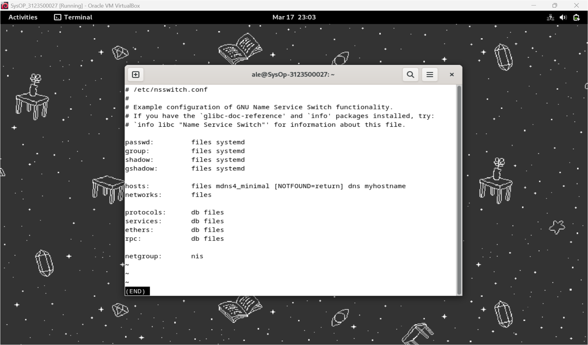
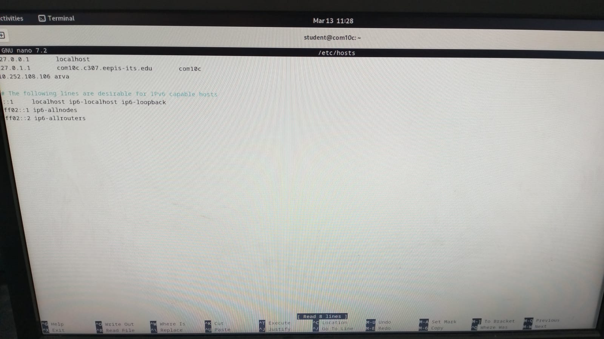
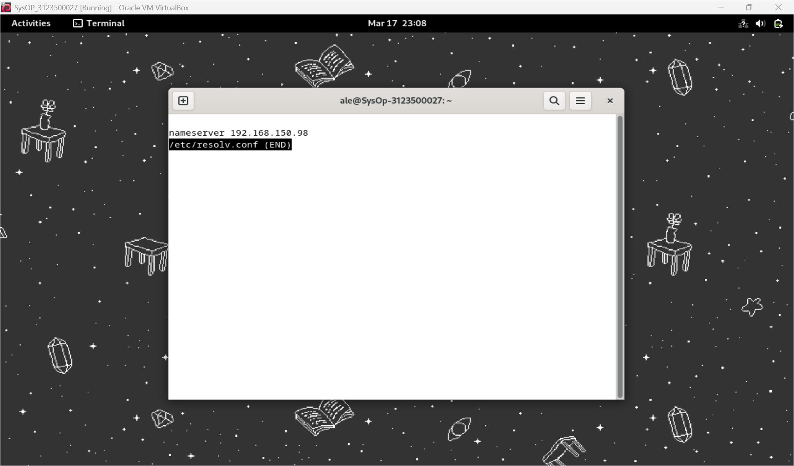
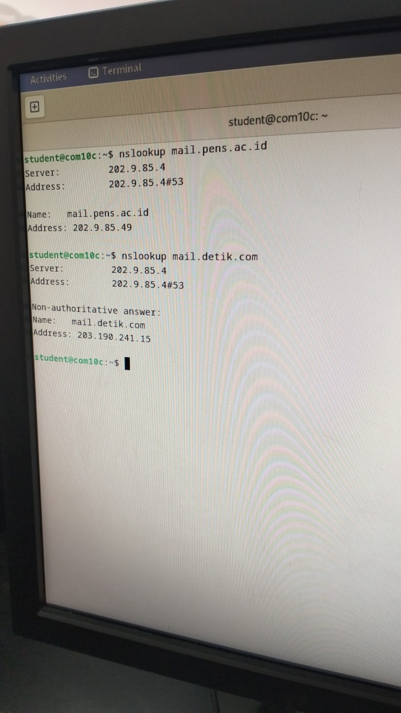
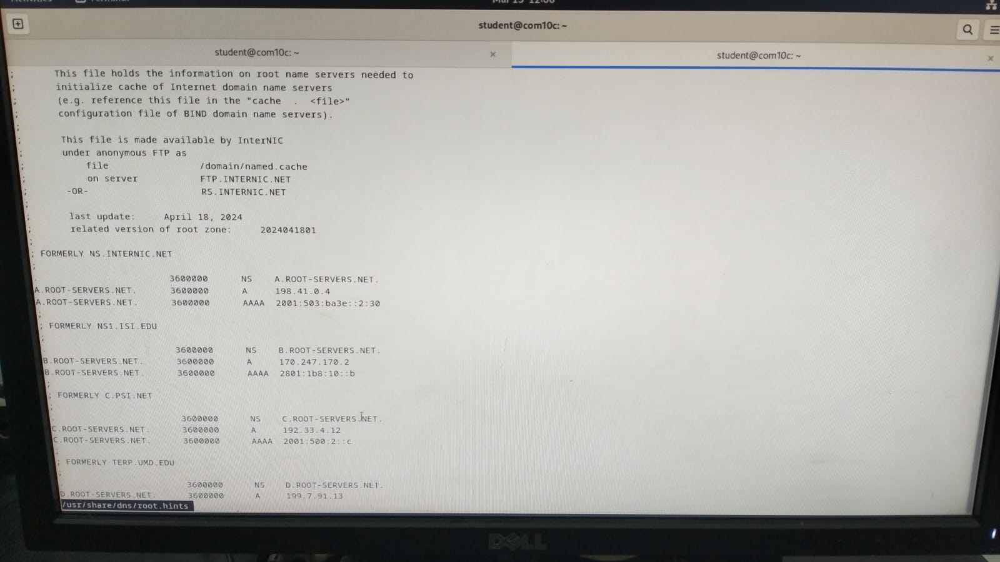

<div align="center">
  <h1 style="text-align: center;font-weight: bold">LAPORAN RESMI<br>WORKSHOP ADMINISTRASI JARINGAN</h1>
  <h4 style="text-align: center;">Dosen Pengampu : Dr. Ferry Astika Saputra, S.T., M.Sc.</h4>
</div>
<br />
<div align="center">
  
  <h3 style="text-align: center;">Disusun Oleh : </h3>
  <p style="text-align: center;">
    <strong>Ale Perdana Putra Darmawan (3123500027) </strong><br>
  </p>
<h3 style="text-align: center;line-height: 1.5">Politeknik Elektronika Negeri Surabaya<br>Departemen Teknik Informatika Dan Komputer<br>Program Studi Teknik Informatika<br>2024/2025</h3>
  <hr><hr>
</div>

## Daftar Isi
- [Daftar Isi](#daftar-isi)
- [Dasar Teori](#dasar-teori)
  - [Pengertian DNS](#pengertian-dns)
  - [Fitur-Fitur DNS](#fitur-fitur-dns)
  - [Domains dan Namespaces](#domains-dan-namespaces)
  - [Zones and Delegation Zone](#zones-and-delegation-zone)
  - [Nameservers](#nameservers)
  - [DNS Resource Records](#dns-resource-records)
  - [DNS Query](#dns-query)
- [Perintah-Perintah DNS](#perintah-perintah-dns)
  - [`Less /etc/nsswitch.conf`](#less-etcnsswitchconf)
  - [`less /etc/host.conf`](#less-etchostconf)
  - [`nano /etc/hosts`](#nano-etchosts)
  - [`sudo less /etc/resolv.conf`](#sudo-less-etcresolvconf)
  - [`nslookup`](#nslookup)
  - [`less /usr/share/dns/root.hints`](#less-usrsharednsroothints)
- [Ekosistem Internet](#ekosistem-internet)
- [Instalasi DNS Server](#instalasi-dns-server)

## Dasar Teori
### Pengertian DNS
DNS (Domain Name System) adalah sistem yang bertugas menerjemahkan nama domain yang mudah diingat manusia (seperti example.com) menjadi alamat IP numerik yang dipahami oleh komputer untuk komunikasi. Dengan adanya DNS, pengguna tidak perlu menghafal deretan angka alamat IP, sehingga akses ke situs web dan layanan internet menjadi jauh lebih praktis dan user-friendly.

### Fitur-Fitur DNS
Globally Distributed:<br>
Beberapa server DNS dikelola oleh operator yang berbeda.

Loosely Coherent<br>
Meskipun didistribusikan, server tetap menjadi bagian dari satu sistem DNS global.

Scalable:<br>
Sistem dapat diperluas dan beberapa server dapat ditambahkan.

Reliable:<br>
Kritis bagi fungsi internet, sehingga harus dapat diandalkan.

Dynamic:<br>
Siapa pun dapat menambahkan domain dan record tanpa menyebabkan gangguan.

### Domains dan Namespaces
Namespace dalam DNS adalah ruang nama hierarkis yang digunakan untuk mengorganisasi dan mengidentifikasi domain secara unik. Domain sendiri dibagi menjadi beberapa level, termasuk Top-Level Domain (TLD) seperti .com, .org, dan .id, Second-Level Domain (SLD) seperti example.com, serta Subdomain seperti blog.example.com. Struktur ini memungkinkan pengelolaan yang lebih terorganisir dan fleksibel.

### Zones and Delegation Zone
dalam DNS adalah bagian dari namespace yang dikelola oleh satu otoritas administrasi tertentu. Delegation terjadi saat otoritas utama mendelegasikan pengelolaan sebagian zone-nya ke pihak lain. Contohnya, pengelolaan subdomain shop.example.com dapat diberikan kepada tim IT terpisah yang bertanggung jawab untuk mengatur zona tersebut secara spesifik.

### Nameservers
Nameserver adalah server yang menyimpan informasi DNS dan bertugas menjawab permintaan klien terkait penerjemahan nama domain. Nameserver dapat berupa authoritative nameserver, yang memegang data asli untuk zona tertentu, atau recursive nameserver, yang mencari jawaban ke berbagai sumber hingga mendapatkan hasil.

### DNS Resource Records
Resource record dalam DNS adalah entri database yang menyimpan informasi spesifik tentang nama domain. Beberapa jenis record penting mencakup A (alamat IP untuk domain), CNAME (alias untuk domain lain), MX (server email), dan TXT (informasi tambahan). Record-record ini menentukan fungsi dan pengaturan setiap domain.

### DNS Query
DNS Query adalah proses permintaan informasi DNS dari klien ke server. Terdapat beberapa jenis query, seperti recursive query (di mana server bertanggung jawab untuk memberikan jawaban lengkap) dan iterative query (di mana server memberikan referensi ke server lain untuk melanjutkan pencarian jawaban).

## Perintah-Perintah DNS
### `Less /etc/nsswitch.conf`
Penjelasan:<br>
Perintah ini digunakan untuk membaca isi file konfigurasi nsswitch.conf, yang menentukan urutan pencarian nama dalam sistem seperti pencarian melalui file lokal, DNS, atau layanan lainnya. Dengan `less`, file ini dapat dibaca tanpa risiko mengubah isinya.
Percobaan:
<br><div style=width:500;></div>

### `less /etc/host.conf`
Penjelasan:<br>
Digunakan untuk membaca file konfigurasi `host.conf`, yang mengatur cara sistem menangani resolusi nama host dan pengaturan multiple IP untuk satu host. Perintah ini memastikan bahwa file dapat ditinjau tanpa perubahan.
Percobaan:
<br><div style=width:500;></div>

### `nano /etc/hosts`
Penjelasan:<br>
Membuka file `/etc/hosts` menggunakan editor teks nano. File ini memetakan nama host ke alamat IP secara manual. Dengan nano, entri baru dapat ditambahkan atau diedit untuk keperluan tertentu, seperti bypass DNS.
Percobaan:
<br><div style=width:500;></div>

### `sudo less /etc/resolv.conf`
Penjelasan:<br>
Digunakan untuk membaca file` resolv.conf`, yang menentukan server DNS yang digunakan oleh sistem. Karena file ini memiliki hak akses terbatas, perintah sudo diperlukan untuk membacanya tanpa memodifikasi.
Percobaan:
<br><div style=width:500;></div>

### `nslookup`
Penjelasan:<br>
Perintah ini adalah utilitas untuk melakukan query DNS. Dapat digunakan untuk mendapatkan informasi seperti alamat IP berdasarkan nama domain atau sebaliknya. Salah satu fungsi command adalah untuk troubleshooting masalah DNS.
Percobaan:
<br><div style=width:500;></div>

### `less /usr/share/dns/root.hints`
Penjelasan:<br>
Membaca file `root.hints`, yang berisi daftar server root DNS. Informasi ini digunakan oleh resolver untuk memulai query ke server root jika diperlukan.
Percobaan:
<br><div style=width:500;></div>

## Ekosistem Internet


## Instalasi DNS Server
Langkah 1:<br>
Instalasi BIND menggunakan perintah `sudo apt -y install bind9 bind9utils`
<br>Percobaan:
<br><div style=width:500;></div>

Langkah 2:<br>
Konfigurasi BIND untuk network internal dalam named.conf menggunakan perintah `sudo nano /etc/bind/named.conf` untuk menambahkan `include "/etc/bind/named.conf.internal-zones";`
<br>Percobaan:
<br><div style=width:500;></div>
<br><div style=width:500;></div>

Langkah 3:<br>
Konfigurasi BIND untuk network internal dalam named.conf.options menggunakan perintah `sudo nano /etc/bind/named.conf.options` untuk menambahkan: 
```bash
        acl internal-network {
                10.0.0.0/24;
        };
...
...
        # add local network set on [acl] section above
        # network range you allow to recieve queries from hosts
        allow-query { localhost; internal-network; };
        # network range you allow to transfer zone files to clients
        # add secondary DNS servers if it exist
        allow-transfer { localhost; };
        # add : allow recursion
        recursion yes;
```
Percobaan:
<br><div style=width:500;></div>
<br><div style=width:500;></div>

Langkah 4:<br>
Konfigurasi BIND untuk network internal dalam named.conf.internal-zones menggunakan perintah `sudo nano /etc/bind/named.conf.options` untuk menambahkan:<br>
```bash
zone "kelompok2.home" IN {
        type master;
        file "/etc/bind/kelompok2.home.lan";
        allow-update { none; };
};
zone "108.252.10.in-addr.arpa" IN {
        type master;
        file "/etc/bind/108.252.10.db";
        allow-update { none; };
};
```
Percobaan:
<br><div style=width:500;></div>
<br><div style=width:500;></div>

Langkah 5:<br>
Konfigurasi BIND untuk network internal dalam /default/named menggunakan perintah `sudo nano /etc/default/named` untuk menambahkan:<br>
```bash
# add
OPTIONS="-u bind -4"
```
Percobaan:
<br><div style=width:500;></div>
<br><div style=width:500;></div>

Langkah 6:<br>
Membuat file zona yang digunakan server untuk menyelesaikan alamat IP dari nama domain, menggunakan perintah `sudo nano /etc/bind/kelompok2.home.lan`
<br>Percobaan:
<br><div style=width:500;></div>
<br><div style=width:500;></div>

Langkah 7:<br>
Buat file zona yang memungkinkan server mengubah nama domain menjadi alamat IP menggunakan perintah `sudo nano /etc/bind/108.252.10.db`
<br>Percobaan:
<br><div style=width:500;></div>
<br><div style=width:500;></div>

Langkah 8:<br>
Restart BIND untuk menyimpan perubahan menggunakan `systemctl restart named`
<br>Percobaan:
<br><div style=width:500;></div>

Langkah 9:<br>
Merubah pengaturan DNS untuk merujuk ke DNS sendiri pada resolv.conf
<br>Percobaan:
<br><div style=width:500;></div>

Langkah 10:<br>
Verifikasi Resolusi Nama dan Alamat menggunakan `dig dlp.kelompok2.home.` dan `dig -x 10.252.108.228`
<br>Percobaan:
<br><div style=width:500;></div>
<br><div style=width:500;></div>