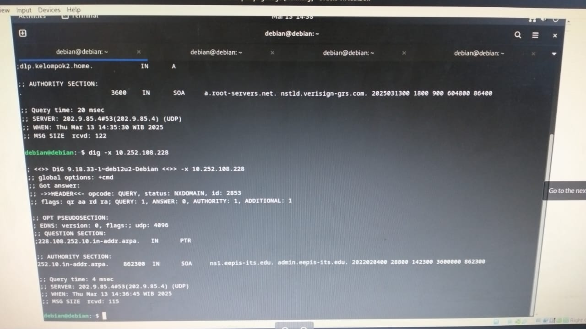

<div align="center">
  <h1 style="text-align: center;font-weight: bold">LAPORAN RESMI<br>WORKSHOP ADMINISTRASI JARINGAN</h1>
  <h4 style="text-align: center;">Dosen Pengampu : Dr. Ferry Astika Saputra, S.T., M.Sc.</h4>
</div>
<br />
<div align="center">
  
  <h3 style="text-align: center;">Disusun Oleh : </h3>
  <p style="text-align: center;">
    <strong>Ale Perdana Putra Darmawan (3123500027) </strong><br>
  </p>
<h3 style="text-align: center;line-height: 1.5">Politeknik Elektronika Negeri Surabaya<br>Departemen Teknik Informatika Dan Komputer<br>Program Studi Teknik Informatika<br>2024/2025</h3>
  <hr><hr>
</div>

## Daftar Isi
- [Daftar Isi](#daftar-isi)
- [Dasar Teori](#dasar-teori)
- [Ekosistem Internet](#ekosistem-internet)
- [Instalasi DNS Server](#instalasi-dns-server)

## Dasar Teori


Less /etc/nsswitch.conf

Less /etc/host.conf

Nano /etc/Hosts

Sudo less resolv.conf

nslookup

less /usr/share/dns/root.hints

## Ekosistem Internet


## Instalasi DNS Server
Langkah 1:<br>
Instalasi BIND menggunakan perintah `sudo apt -y install bind9 bind9utils`
<br>Percobaan:
<br><div style=width:500;></div>

Langkah 2:<br>
Konfigurasi BIND untuk network internal dalam named.conf menggunakan perintah `sudo nano /etc/bind/named.conf` untuk menambahkan `include "/etc/bind/named.conf.internal-zones";`
<br>Percobaan:
<br><div style=width:500;></div>
<br><div style=width:500;></div>

Langkah 3:<br>
Konfigurasi BIND untuk network internal dalam named.conf.options menggunakan perintah `sudo nano /etc/bind/named.conf.options` untuk menambahkan: 
```bash
        acl internal-network {
                10.0.0.0/24;
        };
...
...
        # add local network set on [acl] section above
        # network range you allow to recieve queries from hosts
        allow-query { localhost; internal-network; };
        # network range you allow to transfer zone files to clients
        # add secondary DNS servers if it exist
        allow-transfer { localhost; };
        # add : allow recursion
        recursion yes;
```
Percobaan:
<br><div style=width:500;></div>
<br><div style=width:500;></div>

Langkah 4:<br>
Konfigurasi BIND untuk network internal dalam named.conf.internal-zones menggunakan perintah `sudo nano /etc/bind/named.conf.options` untuk menambahkan:<br>
```bash
zone "kelompok2.home" IN {
        type master;
        file "/etc/bind/kelompok2.home.lan";
        allow-update { none; };
};
zone "108.252.10.in-addr.arpa" IN {
        type master;
        file "/etc/bind/108.252.10.db";
        allow-update { none; };
};
```
Percobaan:
<br><div style=width:500;></div>
<br><div style=width:500;></div>

Langkah 5:<br>
Konfigurasi BIND untuk network internal dalam /default/named menggunakan perintah `sudo nano /etc/default/named` untuk menambahkan:<br>
```bash
# add
OPTIONS="-u bind -4"
```
Percobaan:
<br><div style=width:500;></div>
<br><div style=width:500;></div>

Langkah 6:<br>
Membuat file zona yang digunakan server untuk menyelesaikan alamat IP dari nama domain, menggunakan perintah `sudo nano /etc/bind/kelompok2.home.lan`
<br>Percobaan:
<br><div style=width:500;></div>
<br><div style=width:500;></div>

Langkah 7:<br>
Buat file zona yang memungkinkan server mengubah nama domain menjadi alamat IP menggunakan perintah `sudo nano /etc/bind/108.252.10.db`
<br>Percobaan:
<br><div style=width:500;></div>
<br><div style=width:500;></div>

Langkah 8:<br>
Restart BIND untuk menyimpan perubahan menggunakan `systemctl restart named`
<br>Percobaan:
<br><div style=width:500;></div>

Langkah 9:<br>
Merubah pengaturan DNS untuk merujuk ke DNS sendiri pada resolv.conf
<br>Percobaan:
<br><div style=width:500;></div>

Langkah 10:<br>
Verifikasi Resolusi Nama dan Alamat menggunakan `dig dlp.kelompok2.home.` dan `dig -x 10.252.108.228`
<br>Percobaan:
<br><div style=width:500;></div>
<br><div style=width:500;></div>